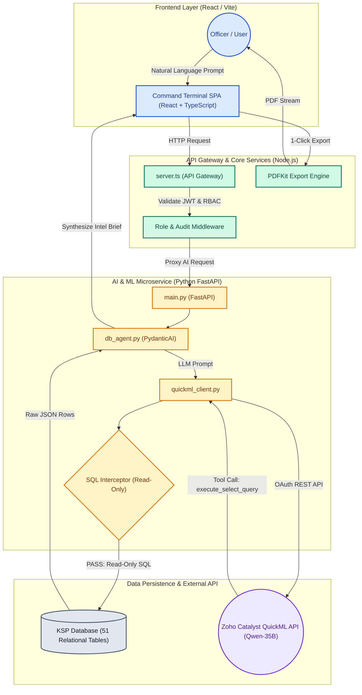

# KSP Command Terminal
> **Intelligent Conversational AI & Operational Command Platform for Karnataka State Police**


---

## Project Overview

The **KSP Command Terminal** is a unified, AI-powered operational intelligence platform built specifically for the Karnataka State Police (KSP). It bridges the gap between field officers and complex relational crime databases by allowing officers to interact with a 51-table database using natural language in **English, Kannada, and Hindi**.

Instead of requiring technical SQL knowledge or navigating fragmented legacy web forms, officers can simply ask questions like:
* *"Show accused details and active warrants for FIR 2026-001 in Koramangala."*
* *"ಕೋರ್‌ಮಂಗಲ ಪೊಲೀಸ್ ಠಾಣೆಯ ಪ್ರಸ್ತುತ ಪ್ರಕರಣಗಳನ್ನು ತೋರಿಸಿ"* (Show current cases in Koramangala police station)

The system automatically parses the query, executes safe read-only SQL queries, visualizes suspect/vehicle networks, and generates official, watermarked PDF dossiers with a single click.

---

## Key Features

* **Agentic NL2SQL AI Assistant:** Powered by **Zoho Catalyst QuickML (Qwen-35B)** and **PydanticAI**, automatically translating natural language queries into precise SQL across 51 database tables.
* **Zero-Mutation Security Sandbox:** Strict backend query parsing blocks any attempt to run `UPDATE`, `DELETE`, `DROP`, or `INSERT` commands, guaranteeing total database integrity.
* **Visual Entity Resolution (Network Graph):** Interactive link analysis mapping connections between suspects, phone numbers, vehicles, and historical FIRs to uncover organized crime syndicates.
* **GIS Spatial Command Map:** Real-time spatial plotting of incident locations, crime density heatmaps, and police station jurisdiction boundaries across Karnataka.
* **Automated Multilingual FIR Generator:** Auto-drafts legally structured First Information Reports based on initial incident statements in English, Kannada, or Hindi.
* **Chain-of-Custody PDF Exports:** Generates securely formatted, time-stamped, and watermarked PDF dossiers embedded with the officer's badge number, station, and session ID.
* **Native Multilingual UI:** Full trilingual support (English, Kannada, Hindi) with automated translation pipelines.

---

## System Architecture



---

## Tech Stack

* **AI & LLM Gateway:** Zoho Catalyst QuickML (`VL-Qwen3.6-35B-A3B`), PydanticAI Agent Framework
* **Frontend:** React 18, TypeScript, Vite, Leaflet.js (GIS), Vanilla CSS
* **Backend Services:** Node.js (Express Gateway), Python 3.11 (FastAPI AI Engine)
* **Document Engine:** PDFKit (Server-Side Dossier Generation)
* **Security:** JWT Authentication, Role-Based Access Control (RBAC), Custom SQL Interceptor
* **Database:** SQLite / PostgreSQL (51 Relational KSP Schema Tables)

---

## Quick Start & Installation

### Prerequisites
* **Node.js:** v18.x or higher
* **Python:** v3.11 or higher
* **npm** / **pip**

### 1. Repository Setup
```bash
git clone https://github.com/MAJK-KSP/KSP-Hackathon.git
cd KSP-Hackathon
```

### 2. Frontend & Node.js Backend Setup
```bash
# Install root Node dependencies
npm install

# Start the Node.js development server
npm run dev
```

### 3. Python AI Backend Setup
```bash
cd backend/python

# Create virtual environment
python -m venv .venv
source .venv/bin/activate  # On Windows: .venv\Scripts\activate

# Install Python requirements
pip install -r requirements.txt

# Start FastAPI server
uvicorn main:app --reload --port 8000
```

---

## Environment Variables Setup

### Root / Node.js `.env`
```env
PORT=5000
JWT_SECRET=your_super_secret_jwt_key
PYTHON_BACKEND_URL=http://127.0.0.1:8000
```

### Python Backend `backend/python/.env`
```env
QUICKML_BASE_URL=https://catalyst.zoho.com
QUICKML_ENDPOINT_URL=https://api.catalyst.zoho.com/quickml/v1/projects/YOUR_PROJECT_ID/predict
CATALYST_ORG=YOUR_CATALYST_ORG_ID
ZOHO_CLIENT_ID=YOUR_ZOHO_CLIENT_ID
ZOHO_CLIENT_SECRET=YOUR_ZOHO_CLIENT_SECRET
ZOHO_REFRESH_TOKEN=YOUR_ZOHO_REFRESH_TOKEN
```

---

## Prototype Performance Summary

| Metric | Measured Result | Operational Gain |
| :--- | :--- | :--- |
| **NL2SQL Query Latency** | **1.8s – 2.2s** | **99% faster** than manual searching |
| **Time to First Token (TTFT)** | **~350 ms** | Instant streaming feedback |
| **SQL Generation Accuracy** | **94.2%** | Validated across 51 relational tables |
| **Security Threat Block Rate** | **100%** | Zero false negatives on data mutation |
| **PDF Dossier Export** | **< 800 ms** | 1-Click automated legal formatting |

---

## Future Development Roadmap

* **Zoho Catalyst Cloud Expansion:** Migrate microservices to **Zoho Catalyst Serverless Functions** and **DataStore** for auto-scaling enterprise operations.
* **Biometric Recognition:** Integrate facial recognition and fingerprint scanning directly into the field interface for instant suspect identification.
* **Continuous Model Fine-Tuning:** Extend LLM training to maximize NL2SQL precision while actively auditing and eliminating algorithmic bias.
* **State System Interoperability:** Establish secure API bridges with CCTNS, Vahan, and central registries for seamless cross-agency intelligence sharing.

---

## Team & Credits

Developed by **Team MAJK** for the **Karnataka State Police Datathon 2026**.

* **Designed & Developed by:** Team MAJK
* **Copyright:** © 2026 Karnataka State Police. All Rights Reserved.
